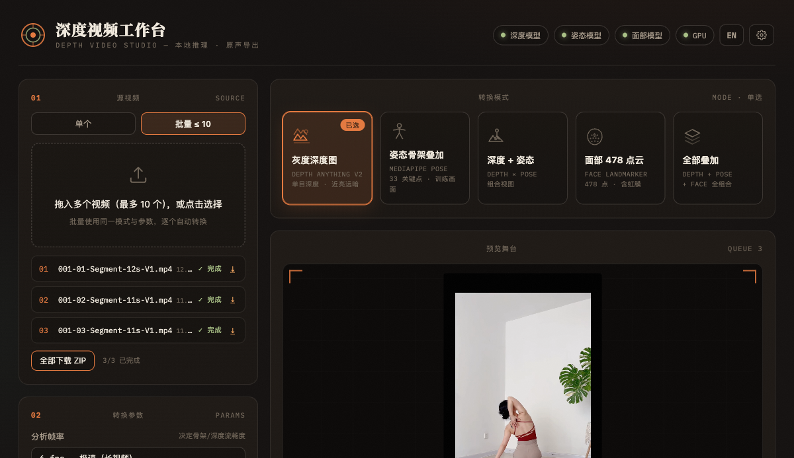

<p align="center">
  
</p>

<p align="center">
  <a href="#try-it-in-10-seconds">Try it</a> ·
  <a href="#what-it-outputs">Modes</a> ·
  <a href="docs/seedance-workflow.md">Motion-control guide</a> ·
  <a href="README.zh-CN.md">中文</a>
</p>

**Depth Video Studio turns any workout or performance video into the control inputs AI video generators need — grayscale depth maps, pose skeletons, 478-point face clouds — entirely inside your browser. No install, no server, no upload, original audio preserved.**

Built for motion control in **Seedance 2.0, Kling, Runway, Viggle** and for fitness content creators who are tired of watermark apps, GPU setup guides, and tools that quietly upload their footage.

## Real output, real speed

A 12-second vertical fitness clip in, motion-control MP4s out — one analysis pass, then every mode re-exports in real time:

<p align="center">
  
  &nbsp;
  
</p>

<p align="center"><sub>Left: live depth conversion · Right: depth frame vs. black-background skeleton frame (the control format)</sub></p>

| 12 s clip, 24 fps, 288 frames | Analysis | Export |
| --- | --- | --- |
| Chrome/Edge + WebGPU (discrete GPU) | ~15–30 s | real-time |
| Chrome/Edge + WebGPU (integrated) | ~30–60 s | real-time |
| WASM fallback | 1–5 min | real-time |

Switching modes reuses the analysis cache — export depth, then the skeleton, each additional export costs only the clip's real-time duration.

## Why this exists

The "AI workout clone" workflow needs a depth or skeleton video next to your reference clip. Today people get it by:

- running Python repos with CUDA environments and 2 GB of downloads, or
- uploading their footage to random web tools, or
- paying for watermark-locked mobile apps at 480p.

This project is a single HTML file that does the whole job locally: [Depth Anything V2](https://huggingface.co/depth-anything/Depth-Anything-V2-Small-hf) for depth, MediaPipe for pose (33 keypoints) and face (478 points incl. iris), WebGPU for speed with automatic WASM fallback, and `MediaRecorder` for MP4/WebM export with the original audio muxed in.

## Try it in 10 seconds

**Online (recommended):** open the hosted demo → **https://beatapi.github.io/depth-video-studio/**

**Offline / single file:** download [`index.html`](index.html) and double-click it.

**From this repo:**

```bash
git clone https://github.com/BeatAPI/depth-video-studio.git
cd depth-video-studio
python3 serve.py        # or: start-server.bat (Windows) / start-server.command (macOS)
```

Requirements: a modern browser — Chrome/Edge 113+ for WebGPU acceleration (Safari 18+/Firefox work via WASM). First run downloads ~65 MB of models, cached by the browser for offline use afterwards. If Hugging Face is unreachable, the app retries via hf-mirror.com automatically. **No Python, no GPU drivers, no build step.**

## What it outputs

| Mode | Output | Use it for |
| --- | --- | --- |
| Depth map | Grayscale mono-depth, near = bright (Inferno colormap optional) | depth control video (recommended default) |
| Pose skeleton | 33 keypoints over the video, or on pure black | pose control / OpenPose-style input |
| Depth + pose | depth background with skeleton overlay | QA and content B-roll |
| Face 478-point cloud | full face mesh incl. iris highlights | expression reference |
| Everything | depth + skeleton + face combined | visual comparison |

Workflow niceties: drag-and-drop, live per-frame preview during analysis, two-phase progress, cancel anytime, temporal EMA smoothing to kill per-frame depth jitter, analysis fps 6–30, bitrate 4–16 Mbps, a bilingual UI (中文 / English), and **batch mode** — queue up to 10 clips with one mode/parameter set, download each result or grab them all as a single ZIP:

<p align="center">
  
</p>

## Feeding the output to a generator

Short version — full guide in [docs/seedance-workflow.md](docs/seedance-workflow.md):

1. Use grayscale depth + your character image as the reference/first frame; keep aspect ratios matched.
2. Temporal smoothing: **Light**. Bitrate: 8–16 Mbps — artifacts in the control video leak into the generation.
3. For limb-precise transfer, export the **skeleton on pure black** instead.

Also pairs well with Kling/Vidu/Wan motion control, Runway-style references, and ComfyUI depth pipelines when you want a zero-install path.

## Privacy

All inference runs locally in your browser. There is no backend, no analytics, and no upload — the entire app is one readable `index.html`, audit it yourself.

## Roadmap

- [x] Batch queue — up to 10 clips, one click, ZIP download
- [ ] Multi-person pose (`numPoses > 1`)
- [ ] Hand landmarks (21 × 2)
- [ ] Larger depth model option (DA-V2 large / Depth Pro)
- [ ] PNG-sequence export for ComfyUI
- [ ] Folder batch via File System Access API

Contributions welcome — the whole app is a single readable file, and good first issues are tagged.

## License

Code: **MIT**. Models run on demand from their official CDNs under their own licenses (Depth Anything V2 — Apache-2.0; MediaPipe — Apache-2.0); this repo redistributes no weights.

---

由 [BeatAPI](https://github.com/BeatAPI) 维护 · 面向创作者的 AI 视频工具 · [中文文档](README.zh-CN.md)
