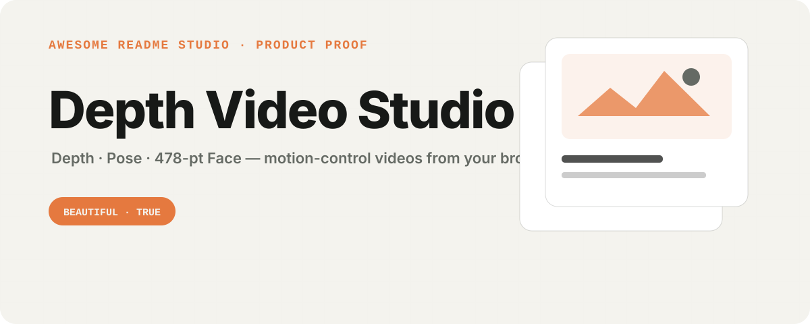
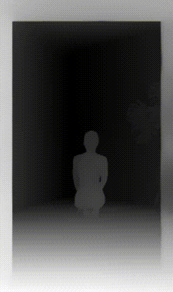
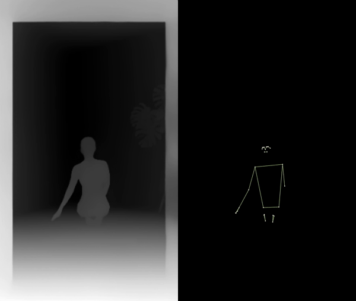

<p align="center">
  
</p>

<p align="center">
  <a href="#10-秒上手">快速开始</a> ·
  <a href="#五种输出">模式</a> ·
  <a href="docs/seedance-workflow.md">动作控制指南</a> ·
  <a href="README.md">English</a>
</p>

**深度视频工作台把任意健身/动作视频转换成 AI 视频生成所需的控制输入——灰度深度图、姿态骨架、478 点面部点云——全部在你的浏览器里完成。免安装、免服务器、免上传，导出保留原声。**

为 **Seedance 2.0、可灵、Runway、Viggle** 的动作控制而生，也为受够了水印 App、GPU 环境配置和「悄悄上传你的视频」的网页工具的健身创作者而生。

## 真实输出、真实速度

12 秒竖屏健身片段进，动作控制 MP4 出——分析一次，所有模式都能实时重新导出：

<p align="center">
  
  &nbsp;
  
</p>

<p align="center"><sub>左：深度实时转换 · 右：深度帧 ⇄ 黑底骨架帧（控制格式）对比</sub></p>

| 12 秒片段 · 24fps · 288 帧 | 分析 | 导出 |
| --- | --- | --- |
| Chrome/Edge + WebGPU（独显） | ~15–30 秒 | 实时 |
| Chrome/Edge + WebGPU（核显） | ~30–60 秒 | 实时 |
| WASM 回退 | 1–5 分钟 | 实时 |

切换模式复用分析缓存——先导深度，再导骨架，每次追加导出只需片段的实时时长。

## 为什么做这个

「AI 健身换人」工作流需要一段深度/骨架视频与参考图搭配。现在大家的获取方式是：

- 折腾 Python 仓库 + CUDA 环境 + 2GB 下载，或者
- 把视频传到不明网页工具的服务器，或者
- 用带水印、锁 480p 的付费手机 App。

本项目用一个 HTML 文件在本地解决全部问题：[Depth Anything V2](https://huggingface.co/depth-anything/Depth-Anything-V2-Small-hf) 做深度、MediaPipe 做姿态（33 关键点）与面部（478 点含虹膜）、WebGPU 加速并自动回退 WASM、`MediaRecorder` 导出混入原声的 MP4/WebM。

## 10 秒上手

**在线试用（推荐）**：打开托管版 → **https://beatapi.github.io/depth-video-studio/**

**离线 / 单文件**：下载 [`index.html`](index.html) 双击打开。

**从源码运行：**

```bash
git clone https://github.com/BeatAPI/depth-video-studio.git
cd depth-video-studio
python3 serve.py        # Windows: start-server.bat · macOS: start-server.command
```

环境要求：现代浏览器——Chrome/Edge 113+ 可用 WebGPU 加速（Safari 18+/Firefox 走 WASM）。首次运行下载约 65MB 模型，之后浏览器缓存、离线可用；HuggingFace 访问失败会自动切 hf-mirror.com。**无需 Python、无需显卡驱动、无需构建。**

## 五种输出

| 模式 | 输出 | 用途 |
| --- | --- | --- |
| 灰度深度图 | 近亮远暗单目深度（可切熔岩伪彩） | 深度控制视频（推荐默认） |
| 姿态骨架 | 33 关键点叠加原视频，或纯黑底 | 姿态控制 / OpenPose 式输入 |
| 深度 + 姿态 | 深度底图 + 骨架 | 质检与内容 B-roll |
| 面部 478 点云 | 全脸网格点，虹膜高亮 | 表情参考 |
| 全部叠加 | 深度 + 骨架 + 面部 | 视觉对比 |

工作台细节：拖拽上传、分析过程逐帧实时预览、双阶段进度、随时取消、时序 EMA 平滑消除逐帧深度抖动、分析帧率 6–30 可调、码率 4–16 Mbps、中英双语界面。

## 喂给生成模型

速览——完整指南见 [docs/seedance-workflow.md](docs/seedance-workflow.md)：

1. 灰度深度作控制视频 + 角色图作参考首帧，两边宽高比保持一致；
2. 时序平滑选**轻度**，码率 8–16 Mbps——控制视频里的压缩瑕疵会渗进生成结果；
3. 更看重四肢动作精度时，改导出**纯黑底骨架**。

同样适用于可灵/Vidu/Wan 动作控制、Runway 类参考流程，以及想要零安装路径的 ComfyUI 深度工作流。

## 隐私

所有推理在浏览器本地完成：无后端、无统计、无上传——整个应用就是一个可读的 `index.html`，欢迎自行审计。

## 路线图

- [ ] 多人姿态（`numPoses > 1`）
- [ ] 手部 21×2 关键点
- [ ] 更大深度模型可选（DA-V2 large / Depth Pro）
- [ ] PNG 序列导出（ComfyUI）
- [ ] File System Access API 批量处理

欢迎贡献——整个应用是一个可读的单文件，已标注 good first issue。

## 许可

代码：**MIT**。模型按需从官方 CDN 加载、遵循各自许可（Depth Anything V2 — Apache-2.0；MediaPipe — Apache-2.0）；本仓库不再分发任何模型权重。

---

由 [BeatAPI](https://github.com/BeatAPI) 维护 · 面向创作者的 AI 视频工具 · [English](README.md)
